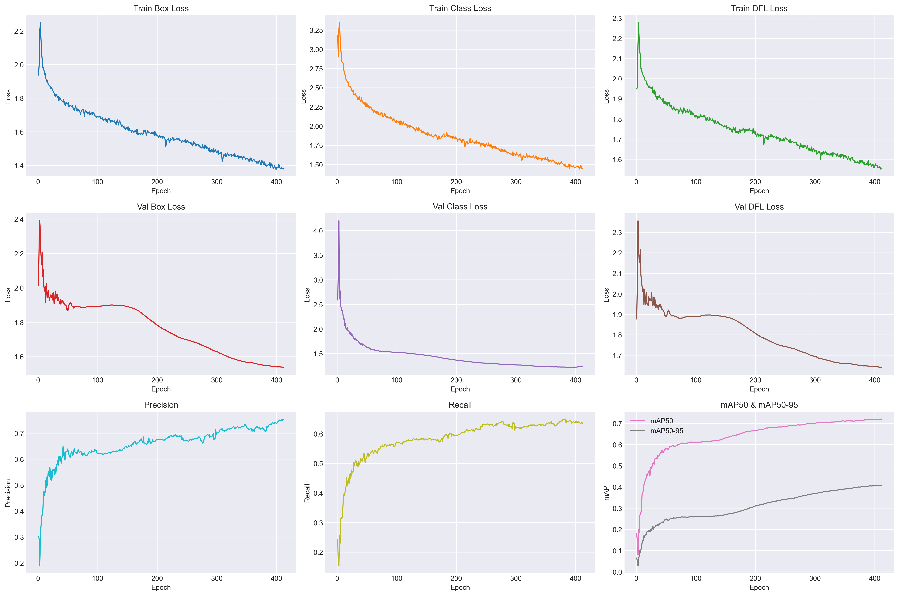

<h1 align="center">
  <br>
   <a href="/">

</a>
  <br>
</h1>

<div align="center">
  [](https://youtu.be/fRQeu2R5udg)
</div>

<br/>

<div align="center">


</div>


<p align="center">
  The <strong>National Landfill Watch</strong> application serves as a public platform for raising awareness about the locations, as well as the climatic and local environmental impact, of landfills on the territory of the Republic of Serbia. The app will focus on displaying data collected during the <strong>2025 TIAC student challenge</strong>.
</p>

## Table of Contents
- [Features](#features)
- [Model Training](#model-training)
  * [Dataset](#-dataset)
  * [Detection](#-detection)
  * [Segmentation](#-segmentation)
- [Tech Stack](#tech-stack)
- [Folder Structure](#folder-structure)
- [Installation](#installation)

## Features
🔍 Detection of illegal landfill sites from **high-resolution orthophoto imagery**.

🧮 Estimatation of each site’s **surface area, volume, and methane emission potential**.

⚠️ Quantification of the **environmental impact radius** and nearby **risk zones**.

📚 **Data transparency and awareness** regarding landfill-related pollution.

🗺️ Results presentation with **segmentation overlays**, **search functionality**, **methane emission**, **impact visualization** and **detailed feature display** support.

## Model Training
### 🖼️ Dataset
All dataset images were resampled to a uniform size of 512×512 pixels. The training and validation datasets include images with spatial resolutions between 0.3 m/px and 1.5 m/px, while the test dataset maintains a fixed spatial resolution of 1 m/px.

**Training and validation datasets**: 
- [SWAD dataset](https://www.kaggle.com/datasets/shenhaibb/swad-dataset?spm=a2ty_o01.29997173.0.0.5cffc921OY75Ce) - global collection of aerial waste disposal imagery, covering various terrain types and landfill morphologies.
- [Global Dumpsite Test Data](https://www.scidb.cn/en/s/6bq2M3?spm=a2ty_o01.29997173.0.0.5cffc921OY75Ce) - high-resolution dumpsite images with diverse visual conditions.

**Test dataset**:
- [Geosrbija](https://a3.geosrbija.rs) - official Serbian orthophoto high-resolution imagery covering the entire national territory.

**Official landfill registry dataset**:
- [The Republic of Serbia Open Data Portal](https://data.gov.rs/sr/datasets/deponije-sanitarne-nesanitarne-i-divlje/) - official registry of various types of landfill sites in Serbia — sanitary, non-sanitary, and illegal (wild) dump sites. It is drawn from the national register of pollution sources (NRIZ).

### 🔍 Detection
We use **YOLOv11m** (a mid-size variant of the YOLOv11 family) for **object detection** of potential landfill sites. The model is fine-tuned on a **custom aerial imagery dataset** that includes both **positive (landfill)** and **negative (non-landfill)** examples.

<div style="display:flex; justify-content:center; margin:1rem 0;">
  <table style="border-collapse:collapse; text-align:center; width:auto;">
    <thead>
      <tr>
        <th style="border-bottom:1px solid #ccc; padding:8px 12px;">Dataset Split</th>
        <th style="border-bottom:1px solid #ccc; padding:8px 12px;">Positive Samples</th>
        <th style="border-bottom:1px solid #ccc; padding:8px 12px;">Negative Samples</th>
        <th style="border-bottom:1px solid #ccc; padding:8px 12px;">Total Images</th>
      </tr>
    </thead>
    <tbody>
      <tr>
        <td style="border-bottom:1px solid #eee; padding:8px 12px;">Train</td>
        <td style="border-bottom:1px solid #eee; padding:8px 12px;">4812</td>
        <td style="border-bottom:1px solid #eee; padding:8px 12px;">9206</td>
        <td style="border-bottom:1px solid #eee; padding:8px 12px;">14018</td>
      </tr>
      <tr>
        <td style="border-bottom:1px solid #eee; padding:8px 12px;">Validation</td>
        <td style="border-bottom:1px solid #eee; padding:8px 12px;">1422</td>
        <td style="border-bottom:1px solid #eee; padding:8px 12px;">2524</td>
        <td style="border-bottom:1px solid #eee; padding:8px 12px;">3946</td>
      </tr>
      <tr>
        <td style="padding:8px 12px;">Test</td>
        <td style="padding:8px 12px;">/</td>
        <td style="padding:8px 12px;">/</td>
        <td style="padding:8px 12px;">357248</td>
      </tr>
    </tbody>
  </table>
</div>

**Training details:**
- **Input resolution:** 512×512 px
- **Input spatial resolution:** 0.3 - 1.5 m/pixel
- **Augmentations:** flipping, rotation, color jitter, mosaic
- **Optimizer:** SGD
- **Losses tracked:** box, class, DFL  
- **Training platform:** YOLOv11 (Python)  
- **Inference data:** 1 m/pixel orthophotos of Serbia  
- **Output:** bounding boxes of detected landfill sites 

<br />
<div align="center">
  
</div>

### 🧩 Segmentation
After detection, each identified landfill region is further **refined using the Segment Anything Model (SAM).** This generates **precise polygon masks** for landfill boundaries, enabling more accurate **area estimation, volume approximation and methane emission calculations.**

- **Segmentation model:** Meta AI's SAM
- **Input:** YOLO-detected regions cropped from orthophotos
- **Output:** pixel-accurate landfill polygons
- **Purpose:** spatial analytics support (area, methane output estimation, environmental footprint)

## Tech Stack
🧠 **ML:** Python, Ultralytics YOLOv11m, SAM

⚙️ **Backend:** .NET 9 (C#) REST API

🗄️ **Database:** PostgreSQL + PostGIS

🖥️ **Frontend:** React, Leaflet, Axios 

## Folder Structure
📦national-landfill-watch<br />
 ┣ 📂client - **frontend**: UI components, map logic, and API integration<br />
 ┣ 📂dataset - **datasets**: .csv data and .sql database table initialisation<br />
 ┣ 📂scripts<br />
 ┃ ┣ 📂detected_landfills - python scripts for generating detected_landfills.csv<br />
 ┃ ┗ 📂registry_landfills - python scripts and .xsls files for generating registry.csv<br />
 ┗ 📂server - **backend**: REST API endpoints, connection to database, analytics aggregation

## Installation

```bash
# Clone the repo
git clone https://github.com/ikabic/national-landfill-watch.git
cd national-landfill-watch

# Install dependencies
npm run setup
```
Download the model detected landfill images from [Google Drive](https://drive.google.com/drive/folders/12D1SJUG60MX1PRch_5PJZvXjgzL4V8dX?usp=sharing) and place them in server/static/images/landfills.

Open the .sql scripts from the dataset folder and change the path to the detected_landfill.csv and registry_landfill.csv in their respective queries:

```bash
COPY landfills(image_name,status,start_year,life_years,area_m2,volume_m3,total_mass_ton,annual_msw_m3,annual_ch4_tonnes,annual_co2e_tonnes,geojson,segmentation,center_lat,center_lon,geom,influence_radius,center_x_px,center_y_px,width_px,height_px) 
FROM 'C:\Users\Admin\Downloads\detected_landfills.csv' # <-- Change path here
DELIMITER ',' CSV HEADER QUOTE '"';
```
Run both .sql scripts after the path adjustment to conclude the setup. To start up the server run the following command:
```bash
# Build frontend then start backend and frontend concurrently
npm run start
```
Finally, to view the website open http://localhost:5173 in your browser.
